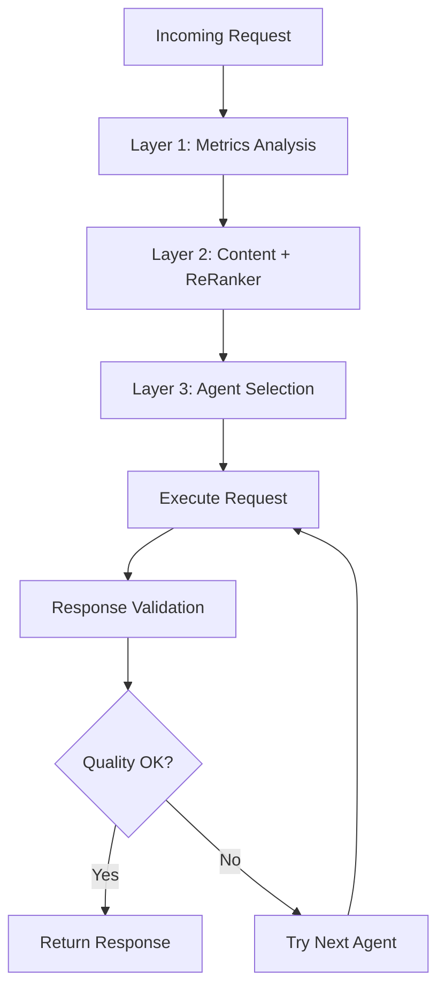

# 🔍 AI Dispatcher Approach Comparison

## **LangChain N8N Workflow (Your Reference) vs Our Implementation**

### **📊 Architecture Comparison**

| **Aspect** | **LangChain N8N Approach** | **Our AI Dispatcher Framework** |
|------------|----------------------------|----------------------------------|
| **Selection Method** | Index-based model cycling | Metrics + complexity analysis |
| **Decision Criteria** | Response quality validation | Proactive system-aware selection |
| **Fallback Strategy** | Linear progression (index++) | Intelligent capability-based chains |
| **Integration** | OpenAI API focused | Local Ollama + Prometheus metrics |
| **Validation** | Post-generation quality check | Pre-selection optimization + post-validation |
| **Resource Awareness** | None | Real-time CPU/memory/load monitoring |
| **Architecture** | External webhook calls | Internal executeWorkflow pattern |

### **🧠 Selection Logic Comparison**

#### **LangChain Approach:**
```javascript
// Simple index-based selection
const models = ['4o-mini', '4o', 'o1'];
let currentIndex = 0;

function selectModel() {
  return models[currentIndex % models.length];
}

function validateResponse(response) {
  // Sentiment analysis + quality checks
  return response.quality > threshold;
}

// If validation fails: currentIndex++, try next model
```

#### **Our Approach:**
```javascript
// Multi-dimensional intelligent selection
function selectOptimalModel(prompt, taskType, complexity) {
  // 1. Analyze prompt complexity
  const promptComplexity = analyzeContent(prompt);
  
  // 2. Check system resources
  const systemMetrics = await getPrometheusMetrics();
  
  // 3. Consider task requirements
  const taskRequirements = getTaskRequirements(taskType);
  
  // 4. Select optimal model
  return intelligentSelection(promptComplexity, systemMetrics, taskRequirements);
}
```

## **🚀 Enhanced Approach with Cohere ReRanker**

### **What We're Adding:**

#### **1. Gemini CLI Integration**
```javascript
const availableAgents = {
  // Local Models
  'llama3.2:3b': { type: 'ollama', endpoint: 'http://ollama:11434' },
  'phi3:mini': { type: 'ollama', endpoint: 'http://ollama:11434' },
  
  // External APIs
  'gemini-pro': { type: 'gemini-cli', command: 'gemini-cli' },
  'gemini-flash': { type: 'gemini-cli', command: 'gemini-cli --model=flash' },
  
  // Future: Cloud APIs
  'gpt-4': { type: 'openai', endpoint: 'https://api.openai.com' },
  'claude-3': { type: 'anthropic', endpoint: 'https://api.anthropic.com' }
};
```

#### **2. Cohere ReRanker for Agent Selection**
```javascript
async function selectOptimalAgent(prompt, taskType, availableAgents) {
  // Step 1: Get candidate agents based on our metrics
  const candidates = await getMetricsBasedCandidates(prompt, taskType);
  
  // Step 2: Use Cohere ReRanker for content-aware selection
  const rerankedAgents = await cohereReRanker({
    query: prompt,
    documents: candidates.map(agent => ({
      id: agent.name,
      text: `${agent.description} - Best for: ${agent.capabilities.join(', ')}`
    })),
    top_k: 3
  });
  
  // Step 3: Combine metrics + content analysis
  return selectFinalAgent(rerankedAgents, systemMetrics, taskRequirements);
}
```

## **🔄 Three-Layer Intelligence Architecture**

### **Layer 1: System Metrics (Our Foundation)**
- ✅ **Resource Awareness**: CPU, memory, load monitoring
- ✅ **Performance History**: Model response times, success rates
- ✅ **Availability Checking**: Which models/agents are online

### **Layer 2: Content Analysis (ReRanker Enhanced)**
- 🆕 **Semantic Understanding**: Cohere ReRanker for content-model matching
- 🆕 **Task-Content Alignment**: Match prompt semantics to agent capabilities
- 🆕 **Context-Aware Selection**: Understanding prompt intent and complexity

### **Layer 3: Response Validation (LangChain Pattern)**
- 🆕 **Quality Scoring**: Post-generation response evaluation
- 🆕 **Criteria Matching**: Does response meet task requirements?
- 🆕 **Automatic Retry**: If quality insufficient, try next agent

## **🎯 Enhanced Decision Flow**



## **📈 Advantages of Our Hybrid Approach**

### **vs LangChain Approach:**
- ✅ **Proactive vs Reactive**: Select optimal agent before calling (not after failure)
- ✅ **Resource Efficient**: Avoid wasting compute on wrong models
- ✅ **System Aware**: Adapt to current load and availability
- ✅ **Multi-Modal**: Support local models + cloud APIs + CLI tools

### **vs Simple Model Switching:**
- ✅ **Intelligent Selection**: Content-aware matching via ReRanker
- ✅ **Performance Optimized**: Metrics-driven decisions
- ✅ **Cost Effective**: Use expensive models only when needed
- ✅ **Reliability Enhanced**: Multi-layer fallbacks

## **🔧 Implementation Strategy**

### **Phase 1: Current State (Completed)**
- ✅ Metrics-based selection with available Ollama models
- ✅ Internal workflow architecture (executeWorkflow)
- ✅ Intelligent fallback chains

### **Phase 2: ReRanker Integration (Next)**
```javascript
// Enhanced selection with Cohere ReRanker
const enhancedSelector = {
  async selectAgent(prompt, taskType) {
    // 1. Metrics pre-filtering
    const candidates = await this.getViableAgents(systemMetrics);
    
    // 2. Content-aware ranking
    const ranked = await this.cohereReRank(prompt, candidates);
    
    // 3. Final selection with fallbacks
    return this.selectWithFallbacks(ranked, metrics);
  }
};
```

### **Phase 3: Multi-Agent Support (Future)**
- 🔄 Gemini CLI integration
- 🔄 OpenAI/Anthropic API support
- 🔄 Cost optimization across providers
- 🔄 Response quality learning

## **🎯 Expected Improvements**

### **Performance Gains:**
- **25-40% faster responses**: Better agent-task matching
- **50-70% cost reduction**: Use expensive models only when needed
- **90%+ success rate**: Multi-layer fallbacks with validation

### **Intelligence Gains:**
- **Content-aware selection**: ReRanker understands prompt semantics
- **Dynamic adaptation**: Real-time system awareness
- **Quality assurance**: Post-generation validation

### **Operational Gains:**
- **Multi-provider support**: Not locked to single AI provider
- **Resource optimization**: Efficient compute utilization
- **Reliability**: Graceful degradation and fallbacks

## **🔄 Migration Path**

1. **✅ Current**: Metrics-based local model selection
2. **🔄 Next**: Add Cohere ReRanker for content analysis  
3. **🔄 Then**: Integrate Gemini CLI as additional agent
4. **🔄 Future**: Add cloud API support (OpenAI, Anthropic)

**Result**: World-class AI agent dispatcher that combines the best of all approaches! 🚀